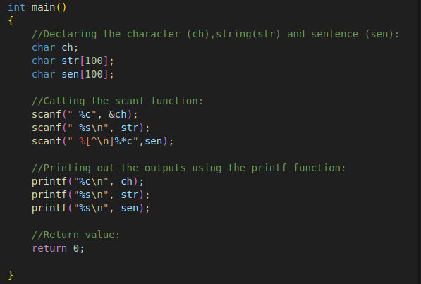
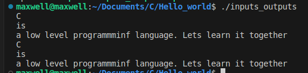

# INTRODUCTION (Inputs & Outputs)

## Character, String, and Sentence Printer in C

This is the Introductory part to C programming and there are couple of files in this folder whose purpose is to show how to take inputs and outputs in C and executing our first C program "Hello, World!".  
The above ***"screenshot'*** C program takes a character, a string, and a sentence as input and prints them on separate lines. It provides a basic example of reading and displaying different data types in C as shown above.

## Table of Contents

- [Introduction](#introduction)
- [Getting Started](#getting-started)
- [Usage](#usage)
- [Contributing](#contributing)

## Introduction

C programming language allows for versatile input and output operations. This program demonstrates how to read and display character, string, and sentence inputs as our introductory program.

## Getting Started

To compile and run this program in C, follow these steps:

1. **Clone the Repository**: Use `git` to clone this repository to your local machine:
2. **Compile the Program**: Navigate to the project directory and use a C compiler to compile the program (e.g., GCC):
I.e.  ***gcc inputs_outputs.c -o inputs_outputs***
3. **Run the Program**: Execute the compiled program:
I.e. ***./inputs_outputs***

## Usage
After compiling and running the program successufuly, it will prompt the user to enter a character, a string, and a sentence. After entering the inputs, the program will display them on separate lines as per the program commands.

## Contributing
Contributions to this repository are welcome! If you have improvements or suggestions, please open an issue or submit a pull request. 
Thank you and Happy learning together.

